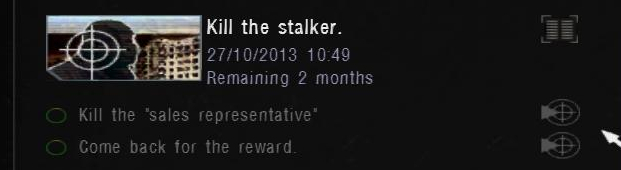

# Editing STALKER SOC save files

## Motivation

I was doing a 100% run of the game S.T.A.L.K.E.R.: Shadow Of Chernobyl with the [Autumn Aurora 2.1 mod](https://www.moddb.com/mods/autumn-aurora-compilation-mod), when I started a side quest to kill the so-called "sales representative", a loner who scams others for their money. Due to him being in a more advanced area of the game at the time, I was not able to complete the quest until later on. I only then noticed, that the quest has a time limit. The quest has to be done and the award aquired in too short of a time. I started thinking about what to do: I did not want to retake the quest, but for that I would need to edit the time to finish the quest.


There is no save game editor out for this game, so we have handle this manually with the binary representation of our saves.

## Structure

I have structured this excourse into file formats and old game code in several parts:

- Finding out what "internal" name the quest has inside the game scripts
- Analyzing the save file format of the game
- Finding the mission entry in the save and edit the time, basically by guessing luckily

## First thoughts and observations

So our overall goal is to increase the time left. First, I looked into the game files. AA (Autumn Aurora) added a folder `gamedata`, in which scripts and other altered content of the game is included. First, I tried to track down the internal name of the quest using `grep`, which might prove to be useful later on:

```sh
valentin@debian:.../STALKER Shadow of Chernobyl/gamedata$ grep -aiHr "sales representative"
<No result>
```

Searching multiple other strings game me some success though, since I found the `task_manager.ltx` file, where all the quests and their settings are saved. But without any obvious relation to my current save. So from there, there was no way to track down the related quest.

I assumed AA mostly includes modified files from the mod, not all of the content in the game. Since we might need everything, I downloaded an [unpacker](https://www.moddb.com/games/stalker/downloads/stalker-extractor) for the .db*-archives in the root directory of the folder:

```
gamedata.db0
gamedata.db1
gamedata.db2
gamedata.db3
gamedata.db4
gamedata.db5
gamedata.db6
gamedata.db7
gamedata.db8
gamedata.db9
gamedata.dba
gamedata.dbb
gamedata.dbc
gamedata.dbd
```

The unpacker is very self-explanatory. We choose the game directory and the output location. Using the same command from above we now get:

```sh
.../unpacked$ grep -aiHr "sales representative"
config/text/eng/stable_task_manager.xml:		<text>Kill the "sales representative"</text>
config/text/eng/stable_task_manager.xml:		<text>Kill the "sales representative". The trader is looking after his reputation</text>
config/text/eng/stable_task_manager.xml:		<text>Imagine this: there's some weirdo running around here who introduces himself as my sales representative, uses my reputation, and then tries to hand off second-rate stuff! Broken barrells, the armor that's falling apart, expired canned goods. I've already had to deal with a few unhappy clients. Bottom line, I need a man to have a little chat with that "sales representative", whatever it takes.</text>
```

Looking into the first result, we find the following XML entry:

```xml
<string id="tm_kill_stalker_6">
	<text>Kill the "sales representative"</text>
</string>
```

So the quest is named `tm_kill_stalker_6`. Looking into the `task_manager.ltx` file:

```
[tm_kill_stalker_6]
type = kill_stalker
community = actor
text = tm_kill_stalker_6_text
description = tm_kill_stalker_6_descr
parent = trader
target = sim_stalker_novice
;reward_money = 1000
reward_reputation = +3
reward_rank = 2
reward_item = af_vyvert, conserva
time = 72000
prior = 1
```

The `type` attribute will prove to be successful later on, but I did not know that at the time. We can edit the quest time, but it does not affect our save, as we can see when changing it and loading the game.

## OpenXRAY, LZO and broken headers

The `.sav` files, that represent our savegames, are not very readable when read into a hex editor like [HxD](https://mh-nexus.de/en/hxd/). To understand how the save mechanic works, we would need to disassemble the games binary. Luckily though, there do exist [source code leaks](https://www.betaarchive.com/forum/viewtopic.php?t=35135) of the game. We can search for the `sav` string to find the `SAVE_EXTENSION` macro, which is also used in the `alife_storage_manager.cpp` file. There, the `CALifeStorageManager::save` method is implemented.

We can assume that the method implements the save-functionality of the game. Lines that stand out are for instance:

```cpp
{
    CMemoryWriter			stream;
    header().save			(stream);
    time_manager().save		(stream);
    spawns().save			(stream);
    objects().save			(stream);
    registry().save			(stream);

    source_count			= stream.tell();
    void					*source_data = stream.pointer();
    dest_count				= rtc_csize(source_count);
    dest_data				= xr_malloc(dest_count);
    dest_count				= rtc_compress(dest_data,dest_count,source_data,source_count);
}
```

So the save-implementation first saves the game and all it's objects, spawns etc. into memory, compresses it and then flushes it into a `.sav` file. It compresses the data using the `rtc_compress` function:

```cpp
u32		rtc_compress	(void *dst, u32 dst_len, const void* src, u32 src_len)
{
	u32		out_size	= dst_len;
	int r = lzo1x_1_compress	( 
		(const lzo_byte *) src, (lzo_uint)	src_len, 
		(lzo_byte *) dst,		(lzo_uintp) &out_size, 
		rtc_wrkmem);
	VERIFY	(r==LZO_E_OK);
	return	out_size;
}
```

We see, the compression algorithm used is LZO1X-1, where 1 is the compression level used. One tool for decompressing these files is `lzop`, but apparently you need a proper LZO header, which does not exist in the `.sav` file, when looking at it with a hex editor like `HxD` or `xxd`:

```sh
valentin@debian:~$ xxd -l 48 36.sav 
00000000: ffff ffff 0300 0000 d9eb 3a00 0e00 0000  ..........:.....
00000010: 0004 0000 0003 0000 0005 0000 0010 4c00  ..............L.
00000020: 0318 ca6a 18c5 3940 010a 0020 4100 0020  ...j..9@... A.. 
```

A proper header looks like this:

```sh
(sav) valentin@debian:~$ lzop -1v 36.sav
compressing 36.sav into 36.sav.lzo
(sav) valentin@debian:~c$ xxd -l 48 36.sav.lzo 
00000000: 894c 5a4f 000d 0a1a 0a10 3020 a009 4002  .LZO......0 ..@.
00000010: 0103 0000 0100 0081 ed5f 7738 6b00 0000  ........._w8k...
00000020: 0006 3336 2e73 6176 55e8 061f 0004 0000  ..36.savU.......
```

Also standing out are the lines, in which the compressed data gets flushed into the file:

```cpp
string_path					temp;
FS.update_path				(temp,"$game_saves$",m_save_name);
IWriter						*writer = FS.w_open(temp);
writer->w_u32				(u32(-1));
writer->w_u32				(ALIFE_VERSION);
	
writer->w_u32				(source_count);
writer->w					(dest_data,dest_count);
xr_free						(dest_data);
FS.w_close					(writer);
```

Where `ALIFE_VERSIOn = 0x0003`. So apparently, the first 12 bytes are not LZO-data. The data corresponds to what we have read. The first 4 bytes are the `u32` constant `-1`, which is the maximum number a `u32` can be assigned to (see Two's Complement). Then the Alife version number and the decompressed size, which depends on the size of our save.

For editing the save file, we will need the following procedure:

```
36.sav - cut 12 bytes    -> 36.sav_c
       - decompress      -> 36.sav_d
       - edit            -> 36_edited.sav_d
       - compress        -> 36_edited.sav_c
       - append 12 bytes -> 36_edited.sav
```

We can do the first with `tail`:

```sh
valentin@debian:~$ tail -c +13 36.sav > 36.sav_c
valentin@debian:~$ xxd -l 48 36.sav_c
00000000: 0e00 0000 0004 0000 0003 0000 0005 0000  ................
00000010: 0010 4c00 0318 ca6a 18c5 3940 010a 0020  ..L....j..9@... 
00000020: 4100 0020 4101 0000 00c4 0e74 0000 0800  A.. A......t....
```

For the LZO decompression: One solution might be to write a small C program that utilizes the lzo-library, which is quite easy to do. But I will use Python for this, since I want to get it done more quickly.

I will use Python 3 and the [python-lzo package](https://github.com/jd-boyd/python-lzo). On Debian based systems, one can install the C dependencies, `pip` and the `venv` package to create a virtual environment. We use a virtual environment, so that we do not affect our system wide Python installation. So to set everything up we do:

```sh
valentin@debian:~$ sudo apt install liblzo2-dev zlib1g-dev python3-pip python3-venv
valentin@debian:~$ python3 -m venv sav
valentin@debian:~$ cd sav
valentin@debian:~/sav$ source bin/activate
```

Now for the script, we just read our savefile and output the decompressed version. It's very simple to do with Python (the complete script looks different and is attached):

```python
save = io.open("36.sav_c", "rb")
data = save.read()
save.close()

decompressed = lzo.decompress(data, False, 3861465)

out = io.open("36.sav_d", "wb")
out.write(decompressed)
out.close()
```

`3861465` is the value of the source_data variable in the C code we saw above. It corresponds to `0x003aebd9`, which is stored in Little Endian since the save was created on Windows. Now we run it:

```sh
valentin@debian:~$ chmod +x decompress.py
valentin@debian:~$ ./decompress.py
```

Before continuing, I wanted to make sure the compression process will be as easy as the decompression process. So we first write a `compress.py` script and make sure the files are equivalent:

```sh
-rw-r--r-- 1 valentin valentin 1001317 Okt  2 14:08 36.sav_c
-rw-r--r-- 1 valentin valentin 1041563 Okt  2 15:32 36.sav_cc
```

I will append improved versions of the Python and Shell scripts (which read the decompressed size automatically, for instance) I use to the post. The files are not equivalent. This does not necessarily mean that we can not load the game anymore though. We append the data we cut off before:

```sh
(sav) valentin@debian:~/sav$ { head -c 12 36.sav; cat 36.sav_cc; } > 36_cc.sav
```

We can load it into the game, so it actually works, which is great! Now we take a look at the `36.sav_d` file which we worked so hard for. We can easily automate this process now too.

## Game code, Lua and finding the actual timing values

Remember the quests name we discovered? `tm_kill_stalker_6` We now skim through the files, which is still in great parts binary data, but much more readable, and try to find the statistics of this running task.

My next thought was to look for the according location of "Remaining", from the above screenshot.

```sh
.../unpacked$ grep -aiHr Remaining
config/text/eng/ui_st_mp.xml:    <text>Time remaining: %d:%d; Agreed %.2f</text>
config/text/eng/ui_st_other.xml:		<text>Remaining</text>
```

We discover the two tags in the `ui_st_other` and the corresponding time locales:

```xml
<string id="ui_st_time_remains">
	<text>Remaining</text>
</string>
```

```xml
<string id="ui_st_mins">
	<text>mins</text>
</string>
```

When searching after these symbols, we discover the task class in `GameTask.h`:

```cpp
class CGameTask
{
    ...
	TASK_ID					m_ID;
	shared_str				m_Title;
	OBJECTIVE_VECTOR		m_Objectives;
	ALife::_TIME_ID			m_ReceiveTime;
	ALife::_TIME_ID			m_FinishTime;
	ALife::_TIME_ID			m_TimeToComplete;
	u32						m_priority;
    ...
};
```

We also see that it gets linked as a Lua type, so this class must be primarily used for scripting. The `SGameTaskKey` class keeps a pointer member to game tasks and is also responsible for serializing them:

```cpp
void SGameTaskKey::save(IWriter &stream)
{
	save_data(task_id,						stream);
	save_data(game_task->m_ReceiveTime,		stream);
	save_data(game_task->m_FinishTime,		stream);
	save_data(game_task->m_TimeToComplete,	stream);
	save_data(game_task->m_Title,			stream);

	u32 cnt	= game_task->m_Objectives.size();
	save_data(cnt, stream);

	OBJECTIVE_VECTOR_IT it		= game_task->m_Objectives.begin();
	OBJECTIVE_VECTOR_IT it_e	= game_task->m_Objectives.end();
	for(;it!=it_e;++it)
		save_data(*it, stream);

}
```

> `NOTE:` Now we know the order in which the information of objectives stored in memory! Great.

> `NOTE:` Not very relevant, but the game implements custom write functions, inspectable in`FS.h`. As far as I have looked into the implementation it looks reasonable, so we do not need to exactly know these functions.

The value we want to manipulate is the one from `m_TimeToComplete`. My approach is to find the `m_Title` value for our task and then track down the timing in the previous bytes. The title gets set in the `SetTitle_script` function, which gets binded to Lua:

```cpp
void					SetTitle_script			(LPCSTR _title);
LPCSTR					GetTitle_script			()							{return *m_Title;};
```

```cpp
module(L)
	[
        ...
        class_<SGameTaskObjective>("SGameTaskObjective")
            .def(constructor<CGameTask*, int>())
            .def("get_title", &SGameTaskObjective::GetTitle_script)
            .def("set_title", &SGameTaskObjective::SetTitle_script)
        ...
    ];
```

We take a look at the unpacked game files again. We discover the file `task_manager.script` by searching for the Lua function `set_title`. We also see that AA wrote this file in our game files too, so we inspect that one. The first important step is the creation of a new task:

```lua
function CRandomTask:action_give_task(actor, npc, p1, p2)
	local task = CGameTask()
	
	-- printf("p1 = %s p2 = %s", tostring(p1), tostring(p2))
	-- dbglog("task_manager.script:action_give_task():  p1 = %s p2 = %s", tostring(p1), tostring(p2))

	local task_desc = self.task_info[self.task_id_by_yes_phrase_id[p2]]
	
	task:load(task_desc.complex_type)
	task:set_title(task_desc.type)
    ...
```

The title gets set to the `type` information from the corresponding `.ltx` file, which we will prove in a bit. The `task_info` table seems to contain all descriptions. Let us take a look at how it gets loaded:

```lua
self.task_info = {}

for i=0,n-1 do
	result, id, value	= self.task_ini:r_line("list",i,"","")

	if not self.task_ini:section_exist(id) then
		abort("There is no section [%s] in task_manager.ltx", id)
	end		

	self.task_info[id]			= {}
	local curr_task_info		= self.task_info[id]

	if not self.task_ini:line_exist(id, "type") then
		abort("Task manager error: no type in section [%s]", id)
	end

	curr_task_info.type			= self.task_ini:r_string(id, "type")			

	curr_task_info.name			= id
	if self.task_ini:line_exist(id, "parent") then
		curr_task_info.parent		= self.task_ini:r_string(id, "parent")
		curr_task_info.complex_type = curr_task_info.type .. "_" .. self.task_info[id].parent
	else
	...
```

So this confirms the assumption that these descriptions get loaded from the `task_manager.ltx` file. We also discover another very important thing: An underscore and the `parent` information gets appended to the `complex_type` variable, which gets saved before our `CGameTask` object if we inspect the code further.

The `type` is `kill_stalker` and the parent is `trader`. Therefore the `complex_type` is `kill_stalker_trader`. Since the codebase is very large, we now systemically probe instances of these strings in our savegame.

> `NOTE:` I also discovered the `quest_time_factor` variable in the `task_manager.script` file, but it does not accomplish what we are trying to do.

Which finally lead to success! Looking at these lines:

```sh
valentin@debian:~$ xxd -l 64 -s +3855360 36_edited.sav_d.backup
003ad400: 0000 0000 6b69 6c6c 5f73 7461 6c6b 6572  ....kill_stalker
003ad410: 5f74 7261 6465 7200 f478 b50b c539 0000  _trader..x...9..
003ad420: 0000 0000 0000 0000 f45e 9518 c539 0000  .........^...9..
003ad430: 6b69 6c6c 5f73 7461 6c6b 6572 0003 0000  kill_stalker....
```

And testing making changes to the savegame, we can conclude that the time saved is `f45e 9518 c539 0000`. We do not know the exact calculation, so we change the first bytes to `ff`:

```sh
valentin@debian:~$ xxd -l 64 -s +3855360 36_edited.sav_d.new
003ad400: 0000 0000 6b69 6c6c 5f73 7461 6c6b 6572  ....kill_stalker
003ad410: 5f74 7261 6465 7200 f478 b50b c539 0000  _trader..x...9..
003ad420: 0000 0000 0000 0000 ffff ffff c539 0000  .............9..
003ad430: 6b69 6c6c 5f73 7461 6c6b 6572 0003 0000  kill_stalker....
```

And after loading the savegame, recompressing it etc., we can discover two additional months to finish the quest:



## Conclusion

This was an interesting problem, since there is hardly any documentation about this specific topic. It was fun to look at such a large codebase and to solve this problem.

Further work could involve making a savegame editor for this game, as it is still very popular among modders and fixing corrupted savegames by mod bugs displays a suitable use case.

To finish this off, I will now present four scripts, with which we can decompress and compress these `sav` files. I will also append my savegame in the `misc` folder of this repository.

<!--
After cloning, we can initialize the submodules in the xray-16 repository

```sh
PS ...\xray-16> git submodule update --init --recursive
```
-->

<!--
Got the time changed!

Observations:

- When browsing the code, we discover the GameTask class and its members
- The set function for the title gets exportet into Lua
- The script sets the title to a type, in this case `kill_stalker`
- Therefore, search for `kill_stalker` in the hex file
- Discover one line with 24 prev bytes, change last 8 to a higher value
- => Recompress, load and see: Time changed ingame

DONE: Proofread this
DONE: Update the code samples with code from the actual leaked SOC source 1.0004 and the mod scripts
-->
